# 잇대

> 다시 시작하는 당신에게, 두 번째 대학을 잇다.

**경력 공백 여성이 작은 직무 체험을 통해 재시작 방향을 탐색하는 서비스**

2026 여기톤 : HE:REthon · Team 16

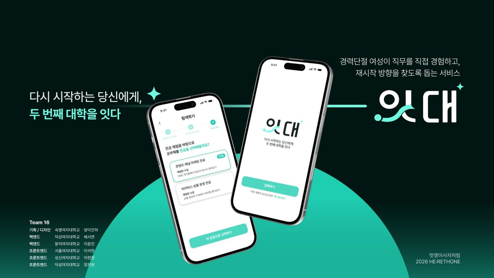

[Figma 디자인](https://www.figma.com/design/L7g7dUDyxGHi4tLBSMwDbX?node-id=78-253)

## 💡 About

잇대는 경력 공백 이후 어떤 일을 시작할지 고민하는 여성에게 탐색과 체험의 기회를 제공합니다. 세 가지 질문으로 두 전공을 제안하고, 각 전공의 작은 업무를 직접 체험한 뒤 비교·선택하도록 구성했습니다. 선택한 전공에서는 단계별 수업을 수행하고 결과물과 소감을 쌓아갑니다.

**탐색 질문 → 두 전공 추천 → 사전 체험 → 비교·선택 → 단계별 전공생활**

## ✨ Key Features

아래 이미지는 발표자료에 포함된 UI 시안입니다. 기능 설명과 구현 방식은 저장소의 Django 코드 기준입니다.

### 01. 탐색 질문과 전공 추천

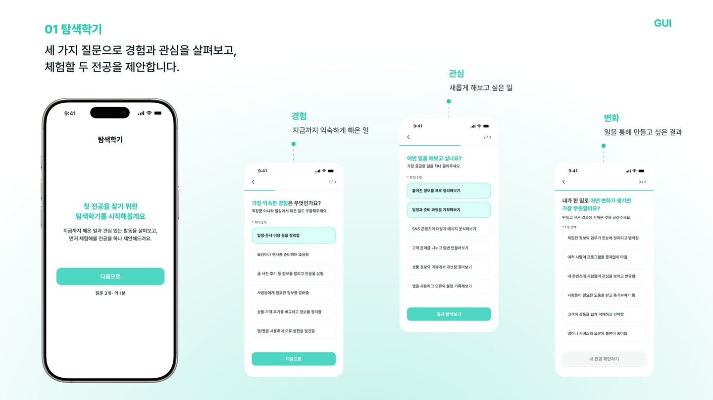

- 세 가지 질문에 대한 선택지를 제출합니다.
- `ChoiceScore`의 전공별 가중치를 사용자 `ScoreRecord`에 누적합니다.
- 점수 내림차순으로 상위 두 전공과 연결된 체험 수업을 보여줍니다.

구현: [search/models.py](./univProject/search/models.py) · [search/views.py](./univProject/search/views.py)

### 02. 두 전공을 체험하고 비교·선택

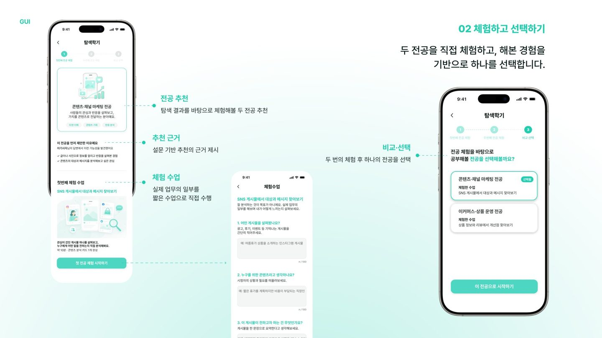

- 추천한 각 전공의 `Experience`와 `ExperienceQuestion`을 화면에 표시합니다.
- 두 전공을 체험한 뒤 공부할 전공을 선택합니다.
- 선택 결과를 `UserProfile.selectedMajor`에 저장하고 탐색 상태를 `selected`로 변경합니다.
- `start_first_lesson()`이 첫 수업을 `in_progress`로 설정하여 내 전공으로 연결합니다.

사전 체험 입력값은 현재 DB 저장 대상에 포함되지 않습니다. 이후 전공 커리큘럼의 수업 답변은 `LessonAnswer`에 저장합니다.

구현: [search/views.py](./univProject/search/views.py) · [curriculums/services.py](./univProject/curriculums/services.py)

### 03. 단계별 커리큘럼과 경험 기록

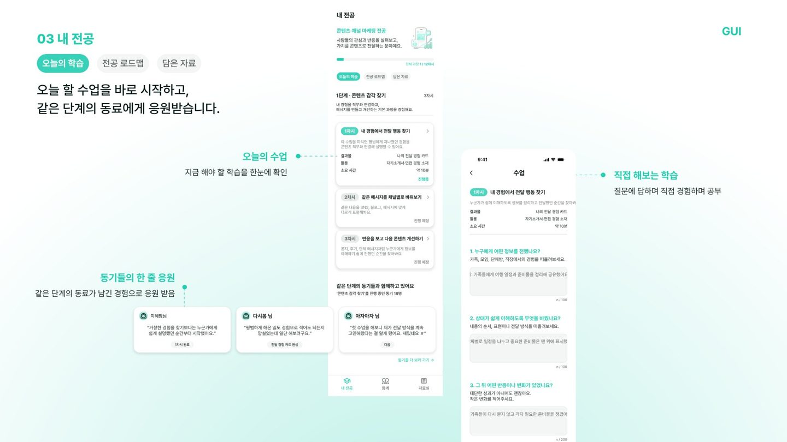

- `Major → Stage → Lesson` 관계로 전공별 커리큘럼을 구성합니다.
- 수업 질문별 답변을 저장하고 완료 화면에서 결과물을 확인합니다.
- 수업 완료와 한 줄 소감을 저장한 뒤 같은 단계의 다음 수업을 시작합니다. 마지막 수업이면 다음 단계의 첫 수업으로 연결합니다.
- 사용자별 수업 진행 상태와 전공 전체 진행률을 표시합니다.

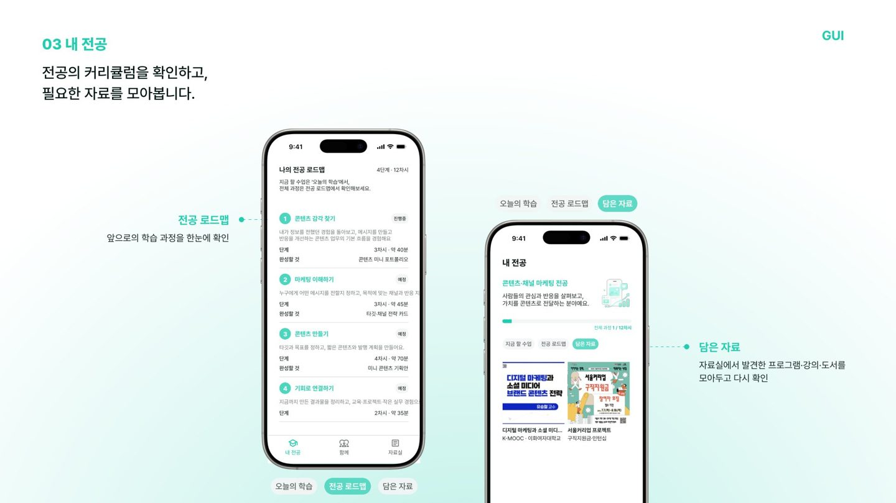

`LessonProgress`는 `locked`, `available`, `in_progress`, `completed` 상태를 정의합니다. 현재 서비스 로직은 첫 수업 또는 다음 수업을 바로 `in_progress`로 변경합니다.

구현: [curriculums/models.py](./univProject/curriculums/models.py) · [curriculums/views.py](./univProject/curriculums/views.py) · [curriculums/services.py](./univProject/curriculums/services.py)

### 04. 자료실과 함께

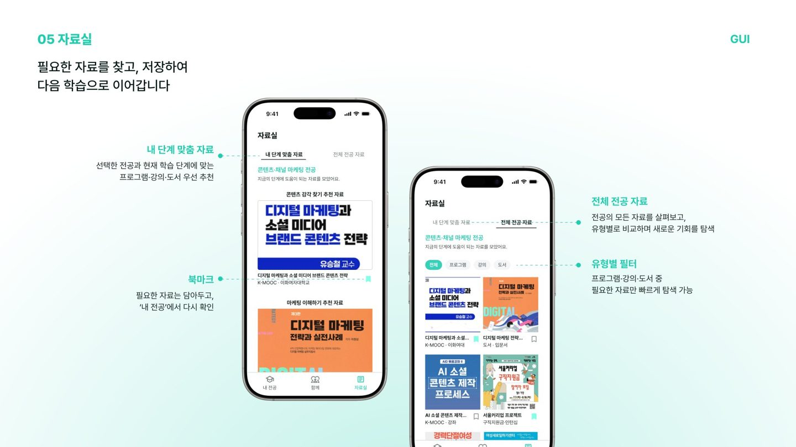

자료실은 선택한 전공의 단계별 자료와 자료 유형별 목록을 제공합니다. 자료를 북마크하거나 해제하고, 내 전공의 담은 자료에서 확인할 수 있습니다. `Material`은 전공·단계·수업과 각각 다대다 관계를 갖습니다.

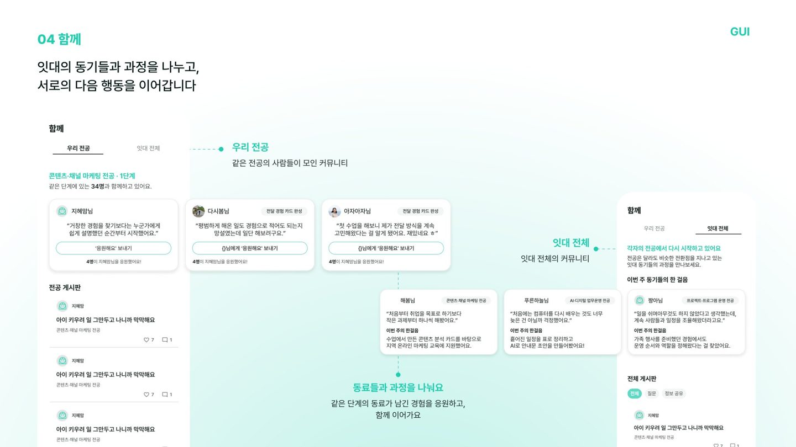

함께에서는 전공·전체 게시판, 질문·정보 공유 분류, 게시글 작성, 댓글·대댓글, 좋아요와 응원을 제공합니다. 다른 사용자의 수업 소감과 소감 응원도 연결합니다.

구현: [materials](./univProject/materials) · [posts](./univProject/posts) · [Bookmark 모델](./univProject/curriculums/models.py)

## 🏗 System Architecture

Django Template로 HTML을 렌더링하는 단일 웹 애플리케이션입니다. 브라우저의 폼 제출과 일부 JavaScript 요청을 Django View가 처리하고, ORM을 통해 SQLite에 데이터를 저장합니다.

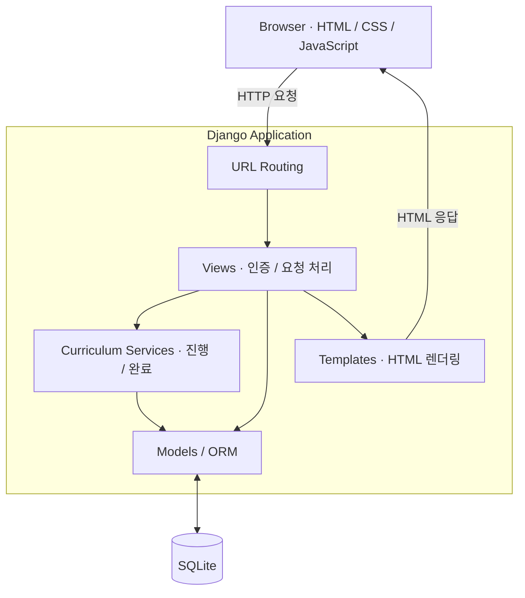

## 🗃 Data Model

핵심 관계를 도메인별로 나누어 표시했습니다. 필드와 일부 보조 모델을 생략한 요약이며, 전체 정의는 각 앱의 `models.py`에서 확인할 수 있습니다.

### 탐색과 선택

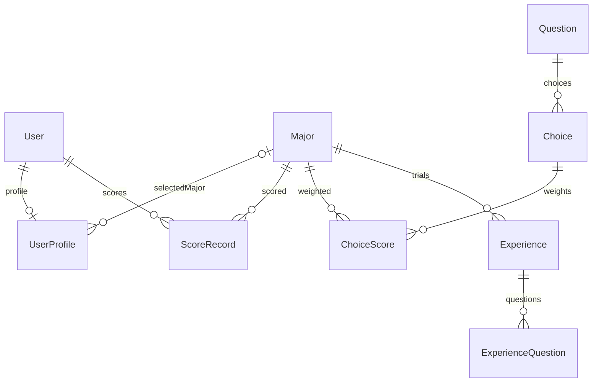

`UserProfile`에는 선택 전공 외에 두 추천 전공을 위한 nullable FK도 정의되어 있습니다. 현재 추천 화면은 `ScoreRecord`를 조회해 전공을 결정합니다.

### 수업과 진행

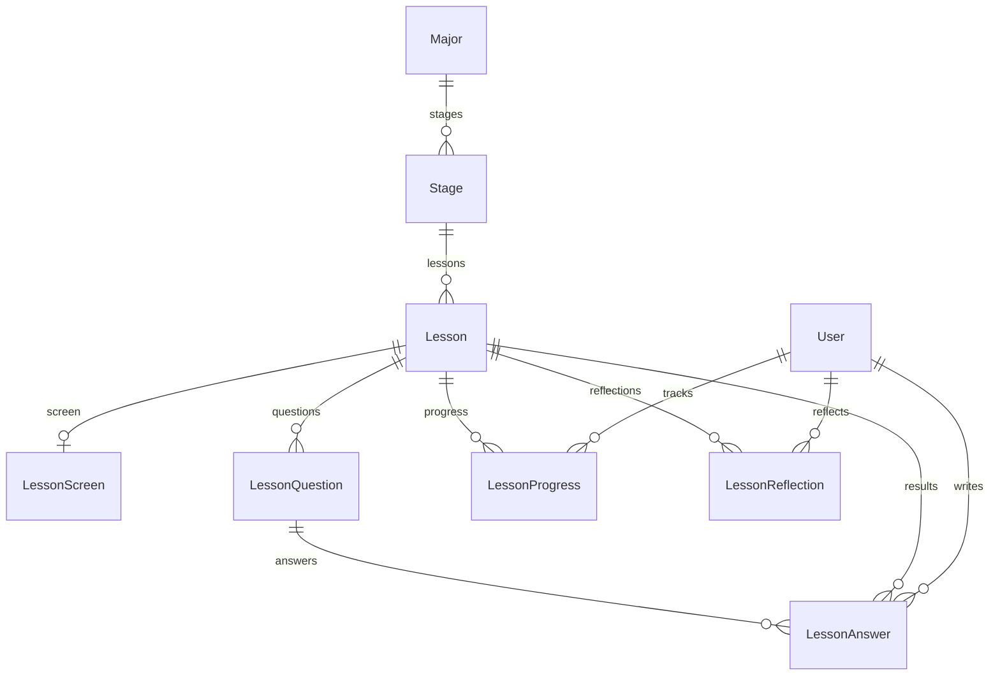

`LessonProgress`와 `LessonReflection`은 사용자·수업 조합, `LessonAnswer`는 사용자·질문 조합에 유일성 제약을 두어 저장합니다.

### 자료와 커뮤니티

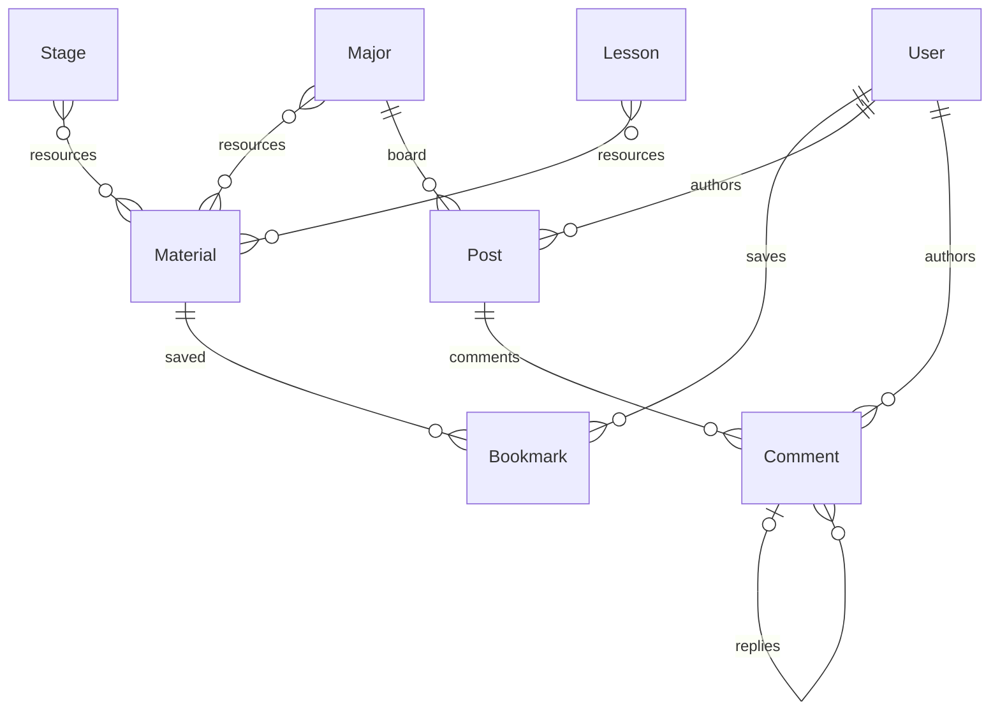

좋아요·응원은 `PostLike`, `PostCheer`, `CommentLike`, `ReflectionCheer`로 분리하며, 대상·사용자 조합의 중복을 제한합니다.

## 🛠 Tech Stack

| 영역 | 기술 |
|---|---|
| Backend | Python · Django 6.0.6 · Django ORM |
| Frontend | Django Template · HTML5 · CSS3 · JavaScript |
| Database | SQLite |
| Authentication | Django Auth · Session |
| Design & Collaboration | Figma · Git · GitHub |

의존성 버전: [requirements.txt](./requirements.txt)

## 📂 Project Structure

| 경로 | 역할 |
|---|---|
| `univProject/manage.py` | Django 관리 명령 진입점 |
| `univProject/univProject/` | 설정, 루트 URL, WSGI·ASGI |
| `univProject/accounts/` | 회원가입·로그인·로그아웃, 사용자 프로필 |
| `univProject/onboarding/` | 서비스 진입·온보딩 |
| `univProject/search/` | 탐색 설문, 점수 기반 추천, 체험, 전공 선택 |
| `univProject/curriculums/` | 수업·답변·진행률·소감·북마크 |
| `univProject/materials/` | 외부 자료와 전공·단계별 목록 |
| `univProject/posts/` | 게시글·댓글·좋아요·응원 |
| `univProject/templates/` | 공통 템플릿 |
| `readme_images/` | README UI 이미지와 팀원 사진 |

각 앱은 모델·뷰·URL·마이그레이션을 포함하고, 화면을 담당하는 앱은 템플릿과 정적 파일을 함께 관리합니다. 커리큘럼의 진행·저장 로직은 `services.py`에 분리했습니다.

### 주요 Routes

| 경로 | 동작 |
|---|---|
| `/accounts/signup/`, `/accounts/login/` | 회원가입·로그인 |
| `/search/select1/` ~ `/search/select3/` | 탐색 질문 |
| `/search/submitAnswer/` | 선택지 제출·점수 누적 |
| `/search/recommend1/`, `/search/recommend2/` | 두 전공 추천 |
| `/search/experience1/`, `/search/experience2/` | 사전 체험 |
| `/search/confirm/` | 전공 비교·선택 |
| `/curriculums/my-major/`, `/curriculums/roadmap/` | 내 전공·로드맵 |
| `/curriculums/lesson/<lesson_id>/` | 수업 조회·답변 제출 |
| `/curriculums/lesson/<lesson_id>/complete/` | 결과물 조회·소감 제출·완료 |
| `/materials/`, `/materials/<material_id>/bookmark/` | 자료 목록·북마크 토글 |
| `/posts/` | 함께 게시판 |

## 🚀 Getting Started

Python 3.12 이상이 필요합니다. 아래 명령은 macOS·Linux 기준입니다.

```bash
git clone https://github.com/2026-HERETHON/2026-herethon-16.git
cd 2026-herethon-16

python3 -m venv .venv
source .venv/bin/activate
python -m pip install -r requirements.txt

cd univProject
python manage.py migrate
python manage.py createsuperuser
python manage.py runserver
```

- 서비스: <http://127.0.0.1:8000/>
- 관리자: <http://127.0.0.1:8000/admin/>
- Windows에서는 가상환경 활성화 명령으로 `.venv\Scripts\activate`를 사용합니다.

### 초기 콘텐츠 데이터

새로 마이그레이션한 DB에는 전공·질문·수업 콘텐츠가 없습니다. 관리자로 로그인하여 데이터를 등록한 뒤, 서비스에서 새 사용자로 회원가입해 탐색을 시작합니다.

1. `Major`를 두 개 이상 등록하고, `Question`의 `order`를 1·2·3으로 설정합니다.
2. 질문별 `Choice`와 전공별 점수인 `ChoiceScore`를 등록합니다. 선택 결과로 두 전공 이상의 점수가 생성되어야 합니다.
3. 전공마다 `Experience`와 `ExperienceQuestion`을 등록합니다.
4. 전공에 `Stage → Lesson → LessonQuestion`을 연결합니다. 수업 화면 문구는 `LessonScreen`으로 설정합니다.
5. 자료실을 사용할 경우 `Material`을 전공·단계·수업에 연결합니다.

기존 DB 백업과 JSON 파일은 완전한 초기 데이터 설치 절차로 검증되지 않았으므로 실행 명령에 포함하지 않았습니다.

### 실행 확인

```bash
python manage.py check
python manage.py showmigrations
```

현재 설정은 로컬 개발용입니다. 배포할 때는 `SECRET_KEY`, `DEBUG`, `ALLOWED_HOSTS`와 정적 파일 제공 설정을 배포 환경에 맞게 구성해야 합니다.

## 👥 Team

<table>
  <tr>
    <td align="center"><br /><strong>양이진하</strong><br /><sub>PM / Designer</sub><br /><a href="https://github.com/Jinnhaa">@Jinnhaa</a></td>
    <td align="center"><br /><strong>이석현</strong><br /><sub>Frontend</sub><br /><a href="https://github.com/LEle-donut91">@LEle-donut91</a></td>
    <td align="center"><br /><strong>이현정</strong><br /><sub>Frontend</sub><br /><a href="https://github.com/hj1222">@hj1222</a></td>
  </tr>
  <tr>
    <td align="center"><br /><strong>정지원</strong><br /><sub>Frontend</sub><br /><a href="https://github.com/stopwonee">@stopwonee</a></td>
    <td align="center"><br /><strong>배서연</strong><br /><sub>Backend</sub><br /><a href="https://github.com/seoyeon615">@seoyeon615</a></td>
    <td align="center"><br /><strong>이윤진</strong><br /><sub>Backend</sub><br /><a href="https://github.com/ylly5">@ylly5</a></td>
  </tr>
</table>

### Contributions

개발 기여는 커밋·PR 기록에서 확인한 대표 작업입니다.

| 팀원 | 담당 및 대표 기여 | 관련 PR |
|---|---|---|
| 양이진하 | 서비스 기획, 사용자 흐름·UI 디자인, 콘텐츠·데이터 명세, 발표자료 | — |
| 이석현 | 탐색·추천·체험 화면, 내 전공 수업·로드맵 UI와 템플릿 연동 | [#26](https://github.com/2026-HERETHON/2026-herethon-16/pull/26), [#58](https://github.com/2026-HERETHON/2026-herethon-16/pull/58) |
| 이현정 | 입학 흐름, 함께 탭 UI, 회원가입·게시판 화면 수정 | [#29](https://github.com/2026-HERETHON/2026-herethon-16/pull/29), [#63](https://github.com/2026-HERETHON/2026-herethon-16/pull/63) |
| 정지원 | 자료실 UI·Django 연동, 좋아요 상호작용 | [#79](https://github.com/2026-HERETHON/2026-herethon-16/pull/79), [#99](https://github.com/2026-HERETHON/2026-herethon-16/pull/99) |
| 배서연 | 커리큘럼·진행·자료실, 게시판 모델·기능 구현 | [#39](https://github.com/2026-HERETHON/2026-herethon-16/pull/39), [#57](https://github.com/2026-HERETHON/2026-herethon-16/pull/57) |
| 이윤진 | 회원·프로필, 설문 점수·추천·체험 조회, 전공 선택과 커리큘럼 연결 | [#18](https://github.com/2026-HERETHON/2026-herethon-16/pull/18), [#38](https://github.com/2026-HERETHON/2026-herethon-16/pull/38), [#68](https://github.com/2026-HERETHON/2026-herethon-16/pull/68) |

## 🤝 Development

- 기능 요청과 버그 제보는 [.github/ISSUE_TEMPLATE](./.github/ISSUE_TEMPLATE)의 양식을 사용합니다.
- 작업 브랜치와 PR을 통해 기능을 통합하고, `dev → main`으로 병합한 기록은 [#107](https://github.com/2026-HERETHON/2026-herethon-16/pull/107)에서 확인할 수 있습니다.
- 커밋 기록에는 `feat`, `fix`, `chore`, `style`, `refactor` 등의 접두사를 사용합니다.

---

UI 이미지: Team 16 잇대 발표자료 · 디자인: [Figma](https://www.figma.com/design/L7g7dUDyxGHi4tLBSMwDbX?node-id=78-253)
