<p align="center">
  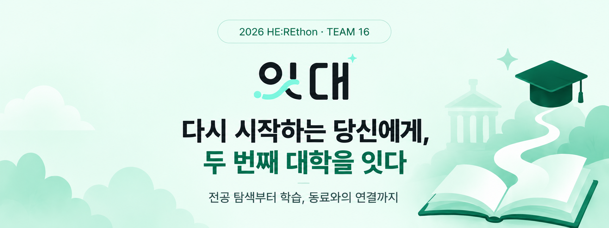
</p>

<p align="center">
  <a href="#about">서비스 소개</a> &nbsp; · &nbsp;
  <a href="#features">주요 기능</a> &nbsp; · &nbsp;
  <a href="#flow">서비스 흐름</a> &nbsp; · &nbsp;
  <a href="#team">팀 소개</a> &nbsp; · &nbsp;
  <a href="#getting-started">실행 방법</a>
</p>

<br />

<a id="about"></a>

## 01 · 서비스 소개

**나에게 맞는 전공을 탐색하고, 작은 배움부터 시작합니다.**

잇대는 새로운 시작을 함께하는 배움의 공간입니다. 지금까지 해온 일과 관심사를 돌아보며 전공을 추천받고, 체험 수업으로 나에게 맞는 분야를 살펴봅니다. 전공을 선택한 뒤에는 단계별 수업과 자료, 동료의 응원을 통해 배움을 이어갑니다.

<p align="center">
  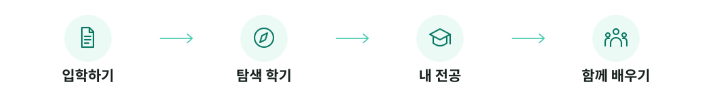
</p>

<br />

<a id="features"></a>

## 02 · 주요 기능

<table>
  <tr>
    <td width="23%" align="center">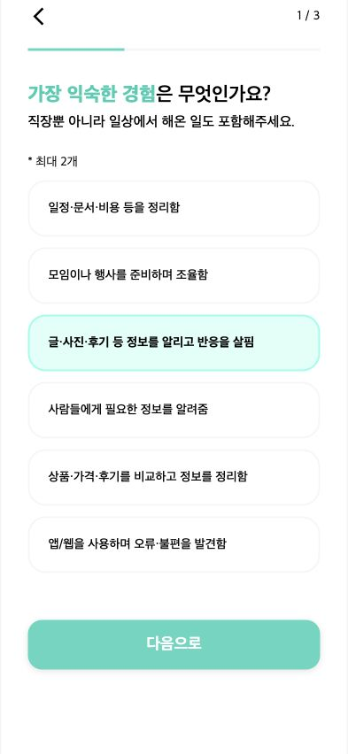</td>
    <td width="27%" valign="middle">
      <sub>01 · EXPLORE</sub>
      <h3>탐색 학기</h3>
      <p>설문과 체험으로 찾는<br /><strong>나의 전공</strong></p>
      <p>해온 경험과 관심사를 돌아보고,<br />추천받은 전공을 체험한 뒤 선택해요.</p>
    </td>
    <td width="23%" align="center">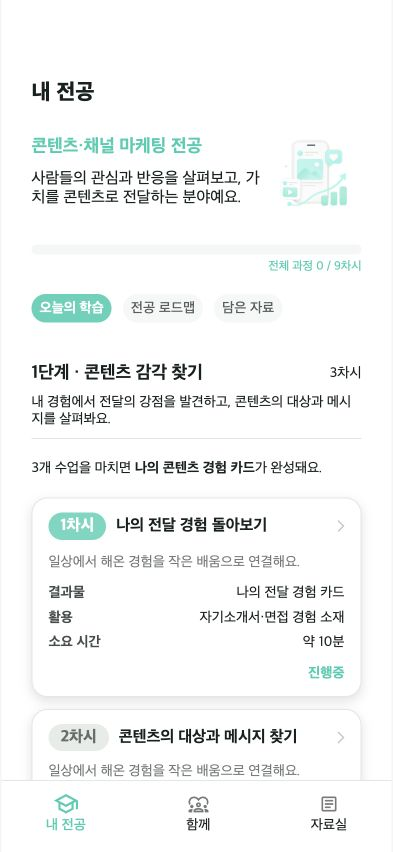</td>
    <td width="27%" valign="middle">
      <sub>02 · LEARN</sub>
      <h3>내 전공</h3>
      <p>오늘의 학습부터<br /><strong>전공 로드맵까지</strong></p>
      <p>진행 중인 수업과 결과물을 확인하고,<br />나의 속도로 다음 단계를 이어가요.</p>
    </td>
  </tr>
  <tr>
    <td align="center">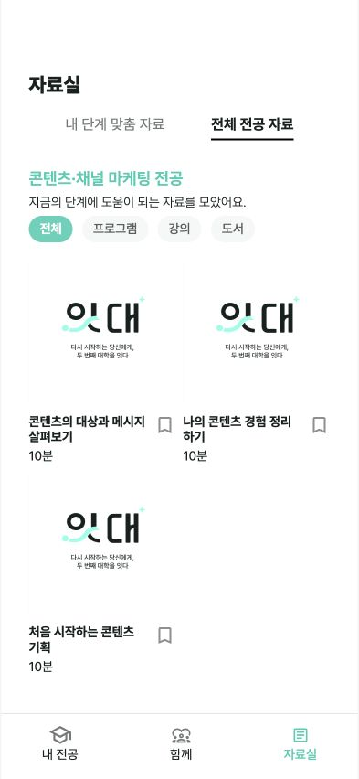</td>
    <td valign="middle">
      <sub>03 · LIBRARY</sub>
      <h3>자료실</h3>
      <p>필요한 전공 자료를<br /><strong>한곳에</strong></p>
      <p>내 단계에 맞는 자료와 전체 전공 자료를<br />살펴보고, 필요한 자료를 담아둬요.</p>
    </td>
    <td align="center">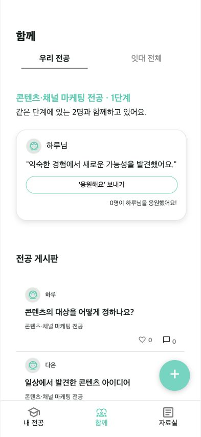</td>
    <td valign="middle">
      <sub>04 · TOGETHER</sub>
      <h3>함께</h3>
      <p>동료와 나누는<br /><strong>배움과 응원</strong></p>
      <p>같은 단계의 동료와 소감을 나누고,<br />게시판에서 질문과 정보를 주고받아요.</p>
    </td>
  </tr>
</table>

<sub>위 이미지는 저장소의 Django 앱을 로컬에서 실행하여 직접 캡처한 실제 화면입니다. 전공 탐색은 저장소의 원본 데이터를 사용했으며, 저장소에 없는 수업·자료·게시글과 계정은 시연 데이터로 구성했습니다. <a href="docs/README_ASSETS.md">캡처 환경 및 데이터 안내</a></sub>

<br /><br />

<a id="flow"></a>

## 03 · 서비스 흐름

<p align="center">
  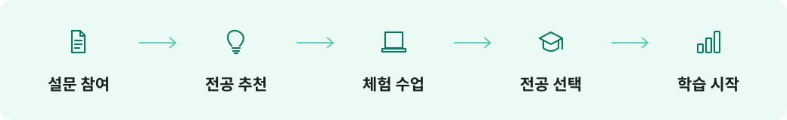
</p>

전공 선택 후에는 **내 전공 · 함께 · 자료실** 탭을 오가며 수업, 동료와의 교류, 학습 자료를 이용합니다.

<br />

## 04 · Tech Stack

<table>
  <tr><th width="240" align="left">구분</th><th width="800" align="left">사용 기술</th></tr>
  <tr><td><strong>Frontend</strong></td><td> 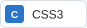 </td></tr>
  <tr><td><strong>Backend</strong></td><td>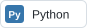 </td></tr>
  <tr><td><strong>Database</strong></td><td>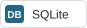</td></tr>
  <tr><td><strong>Design &amp; Collaboration</strong></td><td> 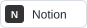 </td></tr>
</table>

<br />

<a id="team"></a>

## 05 · Team

<table>
  <tr>
    <td width="330" align="center">
      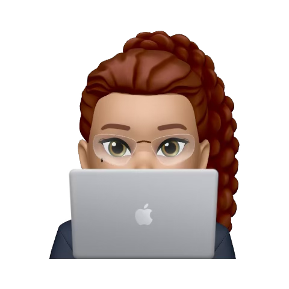<br />
      <strong>양이진하</strong><br /><sub>PM · Designer</sub><br />
      <a href="https://github.com/Jinnhaa">@Jinnhaa</a>
    </td>
    <td width="330" align="center">
      <br />
      <strong>이석현</strong><br /><sub>Frontend</sub><br />
      <a href="https://github.com/LEle-donut91">@LEle-donut91</a>
    </td>
    <td width="330" align="center">
      <br />
      <strong>이현정</strong><br /><sub>Frontend</sub><br />
      <a href="https://github.com/hj1222">@hj1222</a>
    </td>
  </tr>
  <tr>
    <td align="center">
      <br />
      <strong>정지원</strong><br /><sub>Frontend</sub><br />
      <a href="https://github.com/stopwonee">@stopwonee</a>
    </td>
    <td align="center">
      <br />
      <strong>배서연</strong><br /><sub>Backend</sub><br />
      <a href="https://github.com/seoyeon615">@seoyeon615</a>
    </td>
    <td align="center">
      <br />
      <strong>이윤진</strong><br /><sub>Backend</sub><br />
      <a href="https://github.com/ylly5">@ylly5</a>
    </td>
  </tr>
</table>

<br />

<a id="getting-started"></a>
<details>
<summary><strong>실행 방법</strong></summary>

### 1. 프로젝트 준비

Python **3.12 이상**이 필요합니다. 로컬 검증 환경은 Python 3.12.14 / Django 6.0.6입니다.

```bash
git clone https://github.com/2026-HERETHON/2026-herethon-16.git
cd 2026-herethon-16
python3 -m venv .venv
```

macOS / Linux:

```bash
source .venv/bin/activate
```

Windows PowerShell:

```powershell
.\.venv\Scripts\Activate.ps1
```

### 2. 패키지 설치 및 데이터베이스 준비

```bash
python -m pip install -r requirements.txt
cd univProject
python manage.py migrate
```

### 3. 시연 데이터 준비

새로 만든 빈 데이터베이스에서 아래 명령을 실행하면 README와 같은 화면을 확인할 수 있습니다.

macOS / Linux:

```bash
python manage.py shell < ../docs/prepare_demo.py
```

Windows PowerShell:

```powershell
Get-Content -Raw -Encoding UTF8 ..\docs\prepare_demo.py | python manage.py shell
```

이 스크립트는 원본 전공 탐색 데이터에서 사용자 정보 없이 카탈로그만 불러오고, 시연용 수업·자료·게시글·계정을 생성합니다. 기존 사용자나 전공·수업 데이터가 있으면 중단하며 덮어쓰지 않습니다. 실제 운영용 데이터가 아닙니다.

### 4. 로컬 서버 실행

```bash
python manage.py runserver
```

브라우저에서 <http://127.0.0.1:8000/accounts/login/>에 접속합니다.

| 로컬 시연 계정 | 값 |
| :--- | :--- |
| 아이디 | `readme_demo` |
| 비밀번호 | `itdae-local-demo-2026` |

시연 계정에는 전공과 학습 상태가 미리 설정되어 있습니다. 로그인 후 `/curriculums/my-major/`에서 내 전공을, `/search/select1/`에서 설문 화면을 확인할 수 있습니다. 회원가입으로 새로운 전공 탐색도 시작할 수 있습니다.

</details>

<details>
<summary><strong>프로젝트 구조</strong></summary>

```text
2026-herethon-16/
├── README.md
├── requirements.txt
├── readme_images/          # 배너, 실제 캡처, 팀원 이미지
├── docs/
│   ├── prepare_demo.py     # 로컬 시연 데이터 준비
│   └── README_ASSETS.md    # 캡처 환경과 데이터 출처
└── univProject/
    ├── manage.py
    ├── univProject/        # Django 설정 및 URL 구성
    ├── onboarding/         # 서비스 소개
    ├── accounts/           # 회원가입, 로그인, 프로필
    ├── search/             # 설문, 전공 추천, 체험, 선택
    ├── curriculums/        # 수업, 로드맵, 학습 결과, 북마크
    ├── materials/          # 전공 학습 자료
    ├── posts/              # 게시판, 댓글, 좋아요, 응원
    └── templates/          # 공통 템플릿
```

저장소에 남아 있는 이전 데이터베이스 및 중첩 프로젝트 폴더는 위 구조에서 생략했습니다. 실행 기준은 루트 아래의 `univProject/manage.py`입니다.

</details>

<br />

<p align="center"><sub>2026 HE:REthon · Team 16 · 잇대</sub></p>
